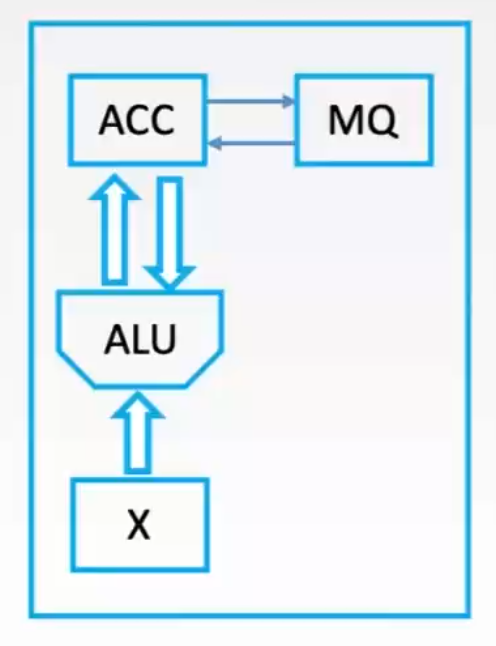
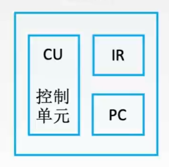
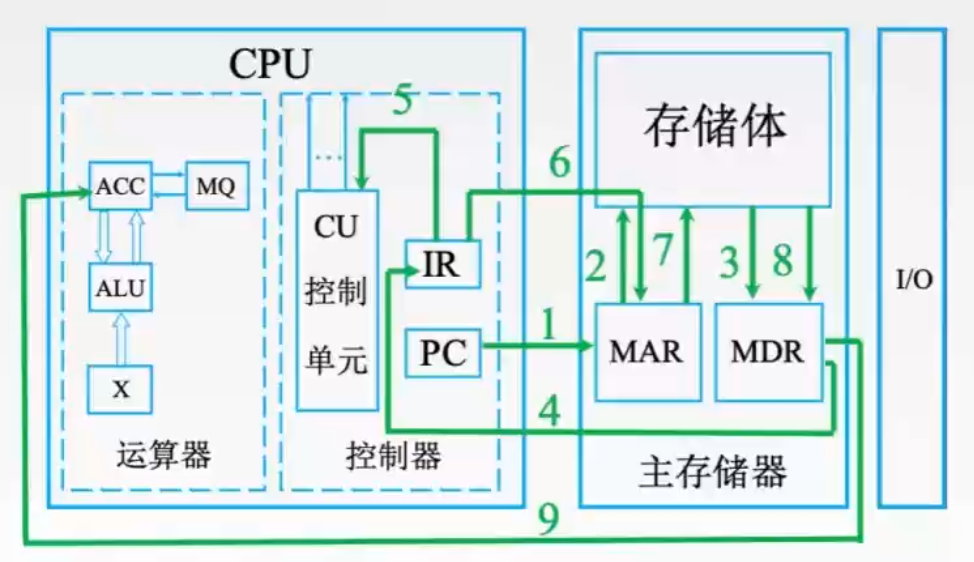
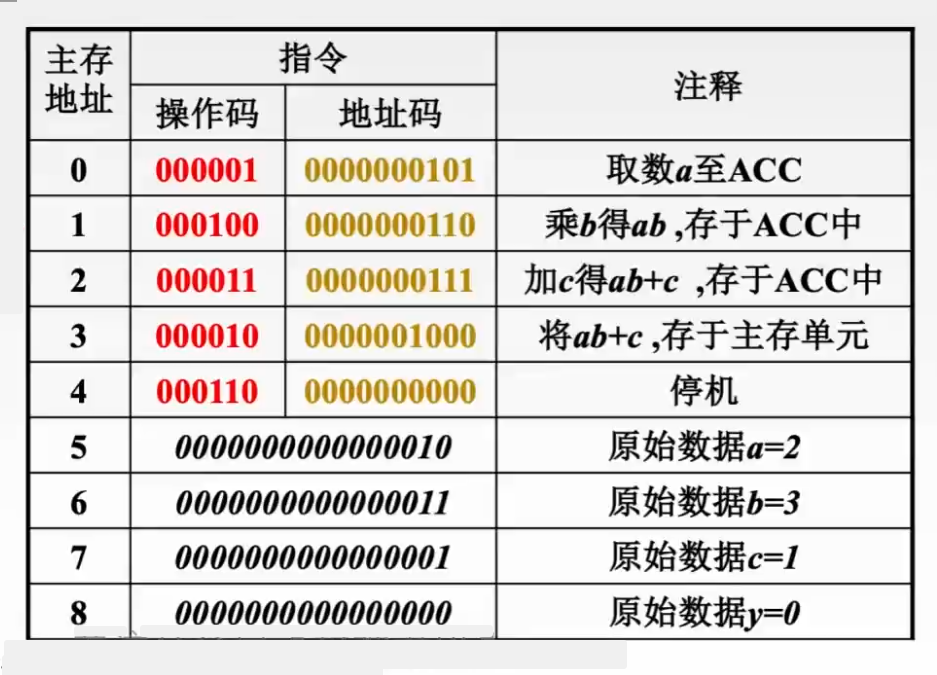

## 回顾
### 运算器的基本组成  
  

|  -  |       名称       |            英文            |                  作用                  |
|:---:|:----------------:|:--------------------------:|:--------------------------------------:|
| ACC |      累加器      |         Accumulator        |       用于存放操作数，或运算结果       |
|  MQ |    乘商寄存器    | Multiple-Quotient Register | 在乘除运算时，用于存放操作数或运算结果 |
|  X  | 通用操作数寄存器 |                            |             用于存放操作数             |
| ALU |   算数逻辑单元   |  Arithmetic and Logic Unit |         实现算数运算、逻辑运算         |

|  - |      ACC     |       MQ       |    X   |
|:--:|:------------:|:--------------:|:------:|
| 加 |  被加数、和  |                |  加数  |
| 减 |  被减数、差  |                |  减数  |
| 乘 |   乘积高位   | 乘数、乘积低位 | 被乘数 |
| 除 | 被除数、余数 |       商       |  除数  |

### 控制器的基本组成
  

|  - |    名称    |         英文         |                 作用                |
|:--:|:----------:|:--------------------:|:-----------------------------------:|
| CU |  控制单元  |     Control Unit     |        分析指令，给出控制信号       |
| IR | 指令寄存器 | Instruction Register |             存放当前指令            |
| PC | 程序计数器 |    Program Counter   | 存放下一条指令地址，有自动加1的功能 |

完成一条指令的过程(取指令 -> 分析指令 -> 执行指令)中分别依靠的单元:  
- 取指令		PC
- 分析指令	IR
- 执行指令	CU

### CPU执行指令的过程
  
以主存地址1中<rm>000100</rm><bm>0000000110</bm>(红色为取数操作码，蓝色为地址码)为例：  
初始PC存储值为0，会执行主存地址0中的取数指令，完成后ACC中的值为2，PC自动加1，开始执行乘法指令
  
1. (PC) --> MAR，将PC值复制到MAR(主存地址寄存器，现代计算机系统通常将其集成在CPU内部)中；
2. 主存电路会根据MAR中的地址值来确定将哪一块值存入MDR(主存数据寄存器，现代计算机系统通常将其集成在CPU内部)中；
3. M(MAR) --> MDR，主存电路根据MAR值将1地址单元中的<rm>000100</rm><bm>0000000110</bm>指令存入MDR；
4. (MDR) --> IR，将MDR中的数据存入IR中，当前IR值为<rm>000100</rm><bm>0000000110</bm>；
5. OP(IR) --> CU，将IR中指令的操作码送入CU中，CU中电路会确认为乘法指令；
6. Ad(IR) --> MAR，将IR中指令的地址码送入主存MAR中，此时MAR的值为0000000101；
7. 同2；
8. M(MAR) --> MDR，主存电路根据MAR值将6地址单元中0000000000000011数据存入MDR；
9. (MDR) --> MQ, 将数值3存入乘商寄存器，当前乘商寄存器值为0000000000000011；
10. (ACC) --> X，将ACC的值即2，传入通用操作数寄存器；
11. (MQ)*(X) --> ACC，由ALU实现乘法运算，此时(ACC)=6，如果乘积太大，则需要MQ辅助存储。

```plain
Tips:
取指令	(1~4)
分析指令	(5)
执行指令	(6~11)
```


## CPU的功能和基本结构
### CPU的五大功能
- **指令控制**：完成取指令、分析指令和执行指令的操作，即程序的顺序控制。
- **操作控制**：一条指令的功能往往是由若干操作信号的组合(如乘法指令中需要将主存中乘数送到MQ，然后将ACC中的被乘数送到X，再然后ALU进行运算，再再然后。。。)，CPU从内存取出的每条指令产生的操作信号并管理它们，把各种操作信号送往相应的部件，从而控制这些部件按指令的要求进行动作。
- **时间控制**：CPU需要保证各个操作的有序执行，因此对各种操作加以时间控制。时间控制要为每条指令按时间顺序提供应有的控制信号。
- **数据加工**：对数据进行算数和逻辑运算。
- **中断处理**：对计算机运行过程中出现的异常情况和特殊请求进行处理。

### 运算器和控制器对五大功能的分工：
- **运算器**：对数据进行加工，即数据加工。
- **控制器**：协调并控制计算机各部件执行程序的指令序列，基本功能包括取指令、分析指令、执行指令；
	- 取指令：自动形成指令地址(如PC自动加"1")；自动发出取指令的命令。
	- 分析指令：操作码译码(<rm>分析本条指令要完成什么操作</rm>)；产生操作数的有效地址(存储器那一章中的数据寻址)
	- 执行指令：根据分析指令得到的"操作命令"和"操作数地址"，形成若干个操作信号组成的控制序列，控制运算器、存储器以及I/O设备完成相应的操作。
	- 中断处理：管理总线及输入输出；处理异常情况(如掉电)和特殊请求(如打印机请求打印一行字符)。

用户<bm>可见</bm>的寄存器：通用寄存器、程序状态字寄存器PSW、程序计数器PC。  
用户<bm>不可见</bm>的寄存器：MAR、MDR、IR、暂存寄存器。

