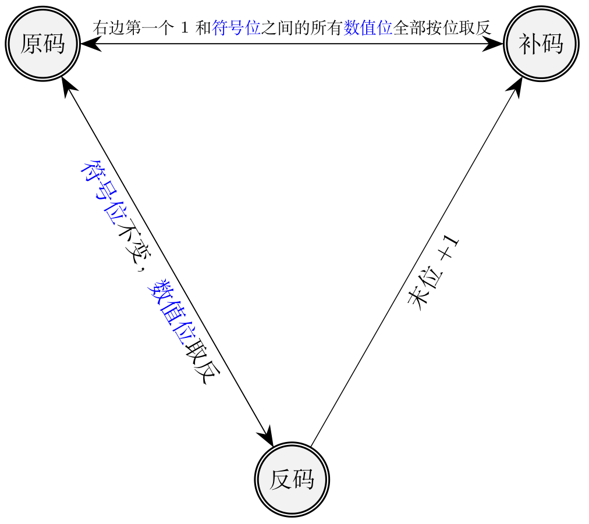
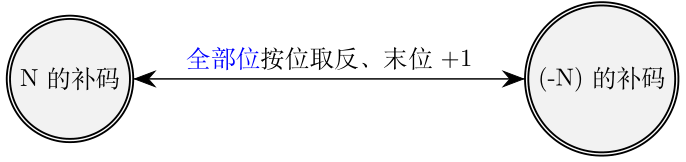
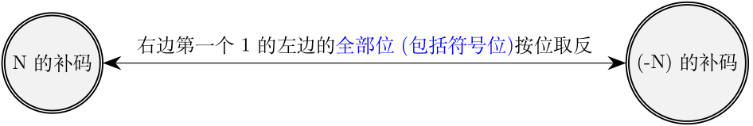

## 数值的表示和运算
### 2.1 数制与编码
#### 2.1.1 进位计数制及其相互转换
:one: 带符号整数的表示和运算
带符号整数主要有原码、反码和补码三种表示形式。三种表示方式中最左边即最高位为符号位：“0”表示正，“1”表示负，其余为数值位。计算机内部，所有<mark>带符号整数</mark>的加、减法都要先转化成为<mark>补码</mark>。

对于正数即符号位为0的二进制数，其原反补码全部相等。

对于<mark>负数</mark>而言其原反补码不同，之间需要一定的转换规则：  

以$-100$为例，其原反补码如下所示：  
$[-100]_原=$**1,** 1100100  
$[-100]_反=$**1,** 0011011  
$[-100]_补=$**1,** 0011100

---
**补码的加法运算**  
:warning: 计算机硬件在做补码加法运算：从低位开始，按位相加（<mark>符号位参与运算</mark>)，并往更高位进位。以8bit寄存器中$(-19)+(-19)$为例：  
$[-19]_补$  = <mark>1</mark>, 1101101

$
\begin{array}{cccccc}
 &1, 1 1 0 1 1 0 1 \\
+&1, 1 1 0 1 1 0 1 \\
\hline
 &1, 1 0 1 1 0 1 0 \\
\end{array}
$

$1, 1011010$ = $[-38]_补$

**补码的减法运算**  
由于计算机减法电路的成本比加法电路高，所以$A-B$一般选用$A+(-B)$，通过加法代替减法的思想。${[N]}_补$和${[-N]_补}$互相转换的过程如下：  
- **方法1：**  
  
分别以19和-19的补码为例：  
$[19]_补$ = $0, 0010011$ $\xrightarrow{全部按位取反}$ $1, 1101100$ $\xrightarrow{末位+1}$ $1, 1101101$ = $[-19]_补$  
$[-19]_补$ = $1, 1101101$ $\xrightarrow{全部按位取反}$ $0, 0010010$ $\xrightarrow{末位+1}$ $0, 0010011$ = $[19]_补$  
- **方法2：**  
  
仍然以19和-19的补码为例：  
$[19]_补$ = $0, 0010011$ $\xrightarrow{从右边第一个1的左边的全部位（包括符号位)按位取反}$ $1, 1101101$ = $[-19]_补$
---

:two: 原码、反码、补码和移码的特性对比  
|     n+1 bit    |            合法表示范围            |        最大的数        |          最小的数         |                   真值0的表示                   |
|:--------------:|:----------------------------------:|:----------------------:|:-------------------------:|:-----------------------------------------------:|
| 定点整数：原码 |    $-(2^n-1) \leq x \leq 2^n-1$    |   $0,111...111=2^n-1$  |   $1,111...111=-(2^n-1)$  | $[+0]_原=0,000...000$ $[-0]_原=1,000...000$ |
| 定点整数：反码 |    $-(2^n-1) \leq x \leq 2^n-1$    |   $0,111...111=2^n-1$  |   $1,000...000=-(2^n-1)$  | $[+0]_反=0,000...000$ $[-0]_反=1,111...111$ |
| 定点整数：补码 |      $-2^n \leq x \leq 2^n-1$      |   $0,111...111=2^n-1$  |     $1,000...000=-2^n$    |               $[0]_补=0,000...000$              |
| 定点小数：原码 | $-(1-2^{-n}) \leq x \leq 1-2^{-n}$ | $0,111...111=1-2^{-n}$ | $1,111...111=-(1-2^{-n})$ | $[+0]_原=0,000...000$ $[-0]_原=1,000...000$ |
| 定点小数：反码 | $-(1-2^{-n}) \leq x \leq 1-2^{-n}$ | $0,111...111=1-2^{-n}$ | $1,000...000=-(1-2^{-n})$ | $[+0]_反=0,000...000$ $[-0]_反=1,111...111$ |
| 定点小数：补码 |      $-1 \leq x \leq 1-2^{-n}$     | $0,111...111=1-2^{-n}$ |      $1,000...000=-1$     |               $[0]_补=0,000...000$              |

$
数的表示法 = 
\begin{cases}
	定点数 & \begin{cases}
						 定点整数（纯整数）\\
						 \\
					   定点小数（纯小数）\\
					 \end{cases}\\
	\\
	浮点数 & 
\end{cases}
$

****
$
$

