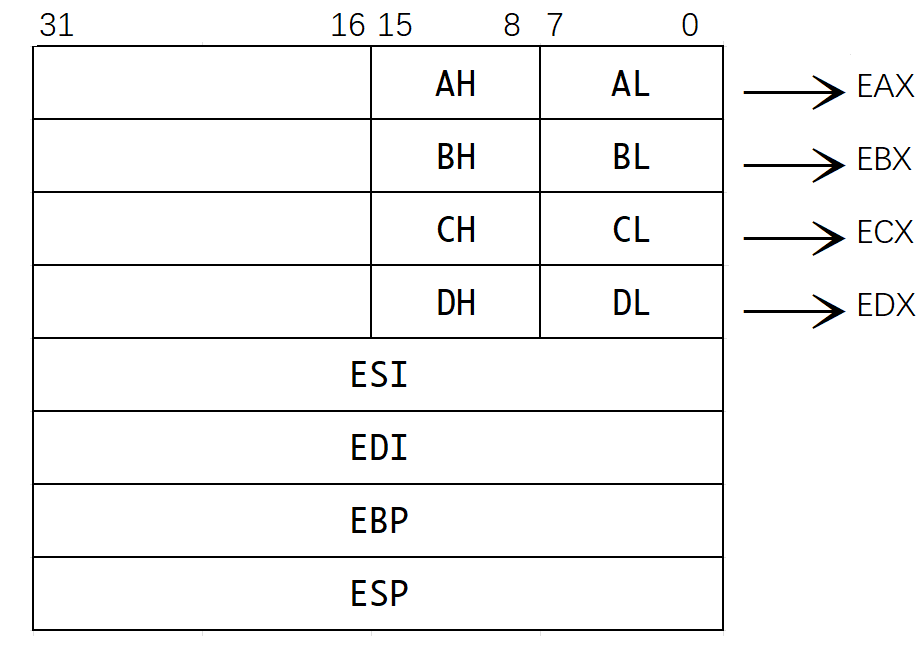

### 基址寻址
定义：将CPU中基址寄存器(BR)的内容加上指令格式中的形式地址A，而形成操作数的有效地址，即EA=(BR)+A。  
:one: 采用专用寄存器BR(base address register)作为基址寄存器  
:two: 采用通用寄存器作为基址寄存器  
在指令中指明作为基址寄存器的通用寄存器的地址。  

:red_circle: 基址寄存器内容由操作系统或管理程序决定，在程序执行过程中，基址寄存器的内容不变，形式地址可变；
当通用寄存器作为基址寄存器时，其内容仍然由操作系统确定；但与专用不同的是，采用通用时用户可以决定使用哪一个作为BR。

优点：<mark>可扩大寻址范围</mark>(基址寄存器的位数大于形式地址的位数)；用户不必考虑程序存于主存的哪个空间区域，因此<mark>有利于多道程序设计，并可用于编写浮动程序</mark>(整个程序在内存中浮动)。

### 变址寻址
定义：有效地址EA等于指令字中的形式地址A与变址寄存器IX(Index Register)的内容相加之和，即EA=(IX)+A；其中IX可由专用也可由通用寄存器充当。  
:red_circle: 变址寄存器面向用户，程序执行过程中，变址寄存器内容可由用户改变(作为偏移量。这里我认为是翻译的错误，所谓变址寄存器应该直译成索引寄存器比较方便用户理解)，形式地址A不变（作为基地址）。  
优点：<mark>扩大了寻址范围</mark>(变址寄存器的位数大于形式地址A的位数)；在数组处理过程中，可设定A为数组首地址，不断改变变址寄存器IX中的内容(相当于改变索引值来访问不同的数组了)，便可容易形成数组中任一数据地址，<mark>特别适合编写循环程序</mark>。  

### 相对寻址
定义：把程序计数器PC的内容加上指令中形式地址A而形成操作数的有效地址，即EA=(PC)+A，其中A是相对于PC所指地址的<mark>位移量, 可正可负，用补码表示。</mark>  
优点：便于程序浮动，由于指令地址之间总是相差一个固定值，因此相对寻址广泛用于转移指令(如循环结构中有三条指令，当这三条指令执行完需要再次进入循环时，就直接用相对寻址“-3”)。  

---

## 程序的机器级表示

### x86中8个32位通用寄存器：
  

| 8bit | 8bit | 16bit | 32bit |             说明            |
|:----:|:----:|:-----:|:-----:|:---------------------------:|
|  AH  |  AL  |   AX  |  EAX  |     累加器(Accumulation)    |
|  BH  |  BL  |   BX  |  EBX  | 基地址寄存器(Base Register) |
|  CH  |  CL  |   CX  |  ECX  |  计数寄存器(Count Register) |
|  DH  |  DL  |   DX  |  EDX  |  数据寄存器(Data Register)  |
|      |      |       |  ESI  |     变址寄存器 S=Source     |
|      |      |       |  EDI  |   变址寄存器 D=Destination  |
|      |      |       |  EBP  |   堆栈基指针(Base Pointer)  |
|      |      |       |  ESP  |  堆栈顶指针(Stack Pointer)  |

Tips:  
- 变址寄存器常用于线性表、字符串的处理；  
- 堆栈寄存器可用于实现函数调用；  
- EAX、EBX、ECX、EDX四个寄存器使用起来比较灵活，其中低16位可以单独使用，在汇编指令中用AX、BX、CX、DX表示；低8位可以单独使用来存单字节数据，在汇编语言用使用AL、BL、CL、DL表示；次低8位也可单独使用，用AH、BH、CH、DH表示。  
- <mark>除了EBP和ESP外，其他几个寄存器的用途是比较任意的。</mark>  
- 在Intel的x86处理器中PC(程序计数器，Program Counter)又被称为IP(指令指针，Instruction Pointer)。

**举例：**  
```plain
mov eax, dword ptr [ebx]	# 将ebx所指主存地址的32bit复制到eax寄存器中
mov dword ptr [ebx], eax	# 将eax的内容复制到ebx所指主存地址的32bit
mov eax, byte ptr [ebx]		# 将ebx的所指的主存地址的8bit复制到eax
mov eax, [ebx]			# 若未指明主存读写长度，默认32bit
mov [af996h], eax		# 将eax的内容复制到af996h所指的地址(未指明长度默认32bit)

mov eax, dword ptr [ebx+8]	# 将ebx+8所指主存地址的32bit复制到eax寄存器中
mov eax, dword ptr [af996-12h]	# 将af996-12所指主存地址的32bit复制到eax寄存器中
```

---

### 常用x86汇编指令介绍
#### 数据传送指令
| 指令 | 英文 |             汇编指令             |                        说明                        |
|:----:|:----:|:--------------------------------:|:--------------------------------------------------:|
|  mov | move |             mov d, s             | 将s所指向存储器中的内容或直接表示的立即数复制到d中 |
| push | push | push \<reg32\>/\<mem\>/\<con32\> |         将操作数压入内存的栈，常用函数调用         |
|  pop |  pop |              同push              |             与push相反，pop执行出栈操作            |

Tips:
- CPU无法一次性完成从内存复制到内存，总是先将内存复制到寄存器然后再将寄存器内容复制到内存。所以mov指令两个操作数不可以同时为内存地址。语法如下：
```plain
mov <reg>, <reg>	# 将寄存器中的内容复制到另一个寄存器中
mov <reg>, <mem>	# 将主存中内容复制到寄存器中
mov <mem>, <reg>	# 寄存器中的内容复制到主存中
mov <reg>, <con>	# 将立即数存入寄存器
mov <mem>, <con>	# 将立即数存入主存
```
- ESP寄存器指向栈顶，栈的增长方向与内存地址增长方向相反，栈中元素定长32位，所以在push指令即压栈操作前会先将ESP中的值-4。push语法如下：  
```plain
push <reg32>	# 将寄存器中的值进行入栈操作
push <mem>	# 将内存中的值压栈
push <con32>	# 将32位立即数压栈

push eax	# 将eax值压栈
push [var]	# 将var所指向的内存的4字节值压栈
```

#### 算数逻辑指令
:one: 算数运算
|  指令名 |    英文   |         汇编指令        |                             说明                             |
|:-------:|:---------:|:-----------------------:|:------------------------------------------------------------:|
| add指令 |    add    |         add d, s        |                      计算d+s, 结果存入d                      |
| sub指令 | substract |         sub d, s        |                      计算d-s, 结果存入d                      |
| mul指令 |  multiply | mul d, s <br> imul d, s | 无符号整数乘法d\*s, 结果存入d <br> 有符号整数d\*s，结果存入d |
| div指令 |   divide  |    div s <br> idiv s    |                           见下Tips                           |
| neg指令 |  negative |          neg d          |                      将d取负，结果存入d                      |
| inc指令 |  increase |          inc d          |                       将d++，结果存入d                       |
| dec指令 |  decrease |          dec d          |                       将d-\-，结果存入d                      |

Tips:
- 除法指令分为带符号整数除法(idiv)和无符号整数除法(div)两种，均只包含除数(即"s")一个操作数；隐含寻址，被除数在运算之前会先进行<mark>位拓展</mark>存入edx:eax(32位被除数被拓展为64位，一半存入edx，另一半存入eax)，操作结果中商存入eax，余数存入edx。
- 算数运算指令中的目的操作数，即"d"<mark>不可以为立即数</mark>，因为算数运算结束后要将结果存入"d"中。  

:two: 逻辑运算
| 运算类型 |     英文     | 汇编指令 |                  说明                  |
|:--------:|:------------:|:--------:|:--------------------------------------:|
|    and   |      and     | and d, s |        将d、s逐位相与，结果放回d       |
|    or    |      or      |  or d, s |        将d、s逐位相或，结果放回d       |
|    not   |      not     |   not d  |         将d逐位取反，结果放回d         |
|    xor   | exclusive or | xor d, s |        将d、s逐位异或，结果放回d       |
|    shl   |  shift left  | shl d, s | 将d逻辑左移s位，结果放回d(通常s为常量) |
|    shr   |  shift right | shr d, s | 将d逻辑右移s位，结果放回d(通常s为常量) |

Tips:
- 逻辑运算指令中的"d"同样因为要存入结果不可以为立即数。

#### 控制流指令
| 指令 |   英文  |    汇编指令    |              说明              |
|:----:|:-------:|:--------------:|:------------------------------:|
|  jmp |   jump  |  jmp \<label\> |  控制IP转移到label所指示的地址 |
|  cmp | compare |    见下Tips    |       比较两个操作数的值       |
| test |   test  |    见下Tips    |    对两个操作数逐位相与运算    |
| call |   call  | call \<label\> | 实现子程序(过程、函数等)的调用 |
|  ret |  return |       ret      | 实现子程序(过程、函数等)的返回 |
Tips:  
- 虽然cmp和test两个指令都没有控制流的作用，但是控制流指令依赖于他们，所以就将他俩也加到了这里。
	+ cmp本质是使两个操作数相减，根据相减后CPU加法器上CF、ZF、

---

### AT&T和Intel两种汇编指令格式
|                            | AT&T格式                                                                                                                                                 | Intel格式                                                                                                                                                              |
|:--------------------------:|:---------------------------------------------------------------------------------------------------------------------------------------------------------|:-----------------------------------------------------------------------------------------------------------------------------------------------------------------------|
|         字母大小写         | AT&T指令格式只能使用小写字母                                                                                                                             | Intel的指令格式对字母大小写不敏感                                                                                                                                      |
| 目的操作数d、源操作数s次序 | op s, d <br> 注：源操作数在左，目的操作数在右                                                                                                            | op d, s <br> 注：源操作数在右，目的操作数在左                                                                                                                          |
|        寄存器的表示        | mov %ebx, %eax <br> 注：寄存器名之前必须加"%"                                                                                                            | mov eax, ebx <br> 注：直接写寄存器名即可                                                                                                                               |
|        立即数的表示        | mov \$985, %eax <br> 注：立即数之前必须加"\$"                                                                                                              | mov eax, 404 <br> 注：直接写立即数即可                                                                                                                                 |
|       主存地址的表示       | mov %eax, (af996h) <br> 注：用“小括号”                                                                                                                   | mov [af996h], eax <br> 注：用“中括号”                                                                                                                                  |
|       读写长度的表示       | movb $5, (af996h) <br> movw $5, (af996h) <br> movl $5, (af996h) <br> addb $4, (af996h) <br> 注：指令后加b、w、l分别表示读写长度为byte、word、double word | mov byte ptr [af996h], 5 <br> mov word prt [af996h], 5 <br> mov dword ptr[af996h], 5 <br> add byte ptr [af996h], 4 <br> 注：在主存地址前说明读写长度byte、word、dword |
|    主存地址偏移量的表示    | movl -8(%ebx), %eax <br> 注：偏移量(基址) <br> movl 4(%ebx, %ecx, 32), %eax <br> 注：偏移量(基址, 变址, 比例因子)                                        | mov eax, [ebx \- 8] <br> 注：[基址+偏移量] <br> mov eax, [ebx + ecx \* 32 \+ 4] <br> 注：[基址+变址\*比例因子\+偏移量]                                                 |
<!-- tmf: $4,2=1 -->

Tips:
- Unix、Linux等操作系统使用AT&T格式，Windows操作系统使用Intel格式。
- 不管是AT&T格式还是Intel格式，指令给出主存地址而未给出读写长度时就默认长度32bit。

