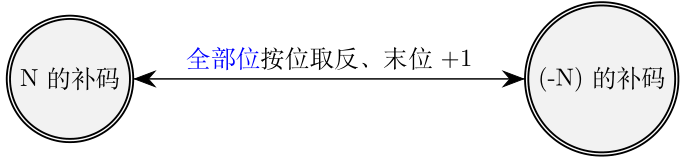

## 数值的表示和运算
### 2.1 数制与编码
#### 2.1.1 进位计数制及其相互转换
:one: 带符号整数的表示和运算
带符号整数主要有原码、反码和补码三种表示形式。三种表示方式中最左边即最高位为符号位：“0”表示正，“1”表示负，其余为数值位。计算机内部，所有<mark>带符号整数</mark>的加、减法都要先转化成为<mark>补码</mark>。

对于正数即符号位为0的二进制数，其原反补码全部相等。

对于<mark>负数</mark>而言其原反补码不同，之间需要一定的转换规则：  

以$-100$为例，其原反补码如下所示：  
$[-100]_原=$**1,** 1100100  
$[-100]_反=$**1,** 0011011  
$[-100]_补=$**1,** 0011100

---
**补码的加法运算**  
:warning: 计算机硬件在做补码加法运算：从低位开始，按位相加（<mark>符号位参与运算</mark>)，并往更高位进位。以8bit寄存器中$(-19)+(-19)$为例：  
$[-19]_补$  = <mark>1</mark>, 1101101

$
\begin{array}{cccccc}
 &1, 1 1 0 1 1 0 1 \\
+&1, 1 1 0 1 1 0 1 \\
\hline
 &1, 1 0 1 1 0 1 0 \\
\end{array}
$

$1, 1011010$ = $[-38]_补$

**补码的减法运算**  
由于计算机减法电路的成本比加法电路高，所以$A-B$一般选用$A+(-B)$，通过加法代替减法的思想。${[N]}_补$和${[-N]_补}$互相转换的过程如下：  
- **方法1：**  
  
分别以19和-19的补码为例：  
$[19]_补$ = $0, 0010011$ $\xrightarrow{全部按位取反}$ $1, 1101100$ $\xrightarrow{末位+1}$ $1, 1101101$ = $[-19]_补$  
$[-19]_补$ = $1, 1101101$ $\xrightarrow{全部按位取反}$ $0, 0010010$ $\xrightarrow{末位+1}$ $0, 0010011$ = $[19]_补$  
- **方法2：**  
  
仍然以19和-19的补码为例：  
$[19]_补$ = $0, 0010011$ $\xrightarrow{从右边第一个1的左边的全部位（包括符号位)按位取反}$ $1, 1101101$ = $[-19]_补$
---

:two: 原码、反码、补码和移码的特性对比  
|     n+1 bit    |            合法表示范围            |        最大的数        |          最小的数         |                   真值0的表示                   |
|:--------------:|:----------------------------------:|:----------------------:|:-------------------------:|:-----------------------------------------------:|
| 定点整数：原码 |    $-(2^n-1) \leq x \leq 2^n-1$    |   $0,111...111=2^n-1$  |   $1,111...111=-(2^n-1)$  | $[+0]_原=0,000...000$ $[-0]_原=1,000...000$ |
| 定点整数：反码 |    $-(2^n-1) \leq x \leq 2^n-1$    |   $0,111...111=2^n-1$  |   $1,000...000=-(2^n-1)$  | $[+0]_反=0,000...000$ $[-0]_反=1,111...111$ |
| 定点整数：补码 |      $-2^n \leq x \leq 2^n-1$      |   $0,111...111=2^n-1$  |     $1,000...000=-2^n$    |               $[0]_补=0,000...000$              |
| 定点小数：原码 | $-(1-2^{-n}) \leq x \leq 1-2^{-n}$ | $0,111...111=1-2^{-n}$ | $1,111...111=-(1-2^{-n})$ | $[+0]_原=0,000...000$ $[-0]_原=1,000...000$ |
| 定点小数：反码 | $-(1-2^{-n}) \leq x \leq 1-2^{-n}$ | $0,111...111=1-2^{-n}$ | $1,000...000=-(1-2^{-n})$ | $[+0]_反=0,000...000$ $[-0]_反=1,111...111$ |
| 定点小数：补码 |      $-1 \leq x \leq 1-2^{-n}$     | $0,111...111=1-2^{-n}$ |      $1,000...000=-1$     |               $[0]_补=0,000...000$              |

$
数的表示法 = 
\begin{cases}
	定点数 & \begin{cases}
						 定点整数（纯整数）\\
						 \\
					   定点小数（纯小数）\\
					 \end{cases}\\
	\\
	浮点数 & 
\end{cases}
$

**恢复余数法**

  

---

### 定点数的乘除运算

#### 运算器的基本组成
运算器：用于实现算术运算、逻辑运算，结构如下：  

ACC：累加器，用于存放操作数或运算结果。
MQ： 乘商寄存器，在乘、除运算时，用于存放操作数或运算结果。
X：  通用的操作数寄存器，用于存放操作数。
ALU：算数逻辑单元，通过内部复杂的电路实现算数运算、逻辑运算。  

各个寄存器在不同运算中的作用：  
| 名称 | 加         | 减         | 乘             | 除           |
|------|------------|------------|----------------|--------------|
| ACC  | 被加数、和 | 被减数、差 | 乘积高位       | 被除数、余数 |
| MQ   |            |            | 乘数、乘积低位 | 商           |
| X    | 加数       | 减数       | 被乘数         | 除数         |

#### 乘法运算
:one: 原码的一位乘法  
符号位通过异或运算单独处理；数值位取绝对值进行乘法运算。  
① 正式开始运算之前：ACC置零，MQ存入乘数，X存入被乘数；  
② MQ最低位为当前参与运算的位，若为1则ACC加上被乘数(ACC和X通过ALU相加并将结果存入ACC)，若为0则ACC加上0；  
③ ACC进行<mark>逻辑右移</mark>，最低位移入MQ成为MQ最高位，MQ右移舍弃最低位，次低位成为最低位即下一次运算的运算位。  
④ 重复②③过程，直到执行次数与数值部分长度一致。

以x=-0.1101和y=+0.1011，采用原码一位相乘为例求$x \cdot y$：  
   
符号位$P_s=x_s \oplus y_s = 1 \oplus 0 = 1$，得$x \cdot y = -0.10001111$。

:two: 补码的一位乘法
与原码一位乘法运算相比：MQ寄存器向右增加一位作为辅助位，而CPU内寄存器的位长是统一的，所以ACC、X等寄存器因此
增加一位而采用双符号位来存储补码，MQ采用单符号位来存储补码。 
1. 正式开始运算之前：ACC置零，MQ最低位(辅助位)置零，其余位存入乘数，X存入被乘数；  
2. 辅助位-MQ“最低位”(乘数最低位，MQ的次低位)
- 结果为1时， ACC+$[X]_补$  
- 结果为0时， ACC+0  
- 结果为-1时，ACC+$[-X]_补$

3. ACC进行<mark>算数右移</mark>，最低位移入MQ成为MQ最高位，MQ右移舍弃最低位，次低位成为辅助位。  
4. 重复②③过程，直到执行次数与数值部分长度一致。  
5. 在进行一次步骤②。得到最终结果。  

#### 除法运算
:one: 原码的除法：恢复余数法
商的符号位通过异或得出；数值位取绝对值参与运算。  
1. 正式开始运算之前，ACC存入被除数，X存入除数，MQ置零。  
2. 最低位当前要求的商位，先取1，若ACC加上$[-除数]_补码$为正，则进入下一步，否则取0并对ACC恢复余数，即ACC加$[除数]_补$。  
3. 是否计算了n+1(n个数值位，1个符号位)? 是则结束，否进入④。  
4. ACC和MQ都进行逻辑左移，低位补0。  

:two: 原码的除法：加减交替法(不恢复余数法)
商的符号位同样通过异或得出；数值位取绝对值参与运算。  
1. 正式开始运算之前，ACC存入被除数，X存入除数，MQ置零。  
2. 
    
3. 若最后一次加完后余数为负值，需要商0并使ACC加$[|除数|]_补$得到正确余数。  

:three: 补码的除法：加减交替法  

