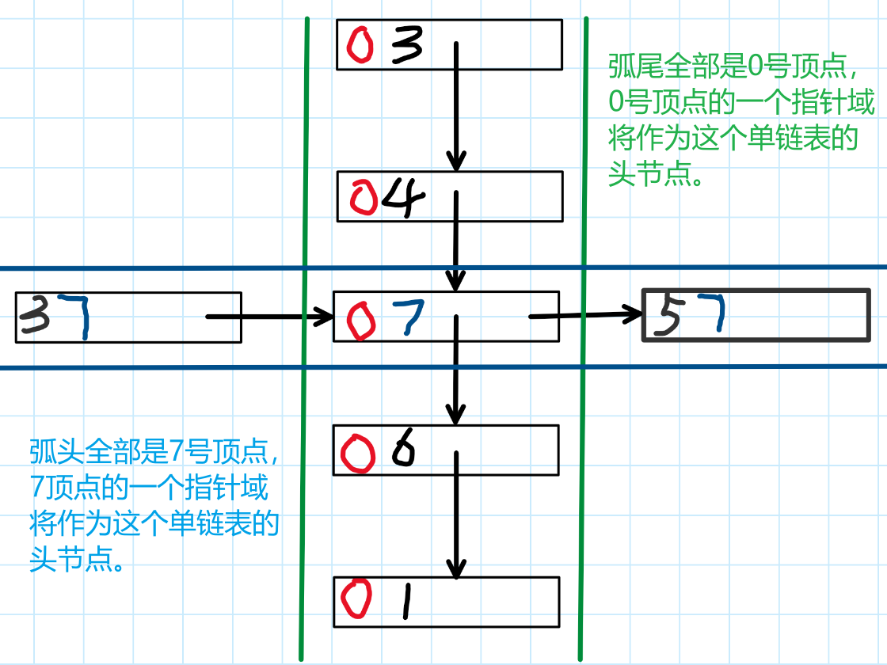
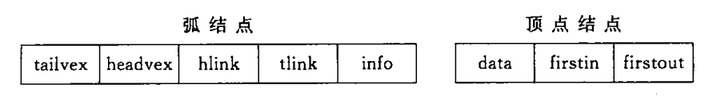

### 十字链表——专攻有向图的链式存储结构

十字链表本质上是对邻接表的升级。在邻接表的基础上，
对顶点节点再增加一个指针指针域；在此之前：
邻接表的顶点节点只有一个指针域，
这使得顶点节点只能作为以它为弧尾的弧的单链表的头节点，
这样统计顶点的出度是方便的，但是统计入度就没那么方便了；

  

  

于是，十字链表的想法很简单：顶点既是以它为弧尾的弧的单链表的头节点，
又是以它为弧头的弧的单链表的头节点，所以对头结点的改造就是增加一个指针域，两个指针域一个指向“弧头”单链表，一个指向“弧尾”单链表。
所以，弧节点也要增加一个指针域，一个用来指向弧头相同的其他弧节点，
另一个用来指向弧尾相同的其他弧节点，如上图所示，这也是“十字链表”名称的由来。

