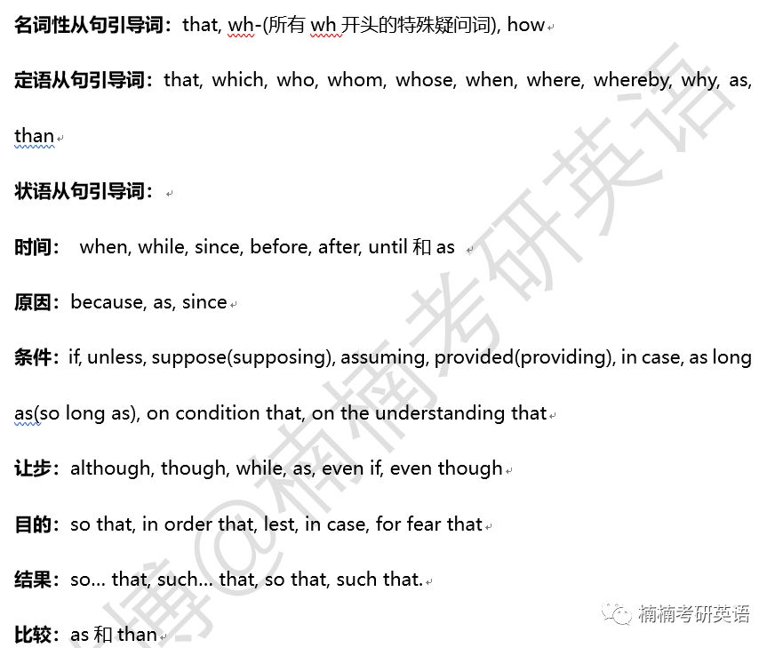

## 复合句

复合句由多个简单句构成，每个简单句的灵魂是谓语动词，而将这些简单句连接起来的是从句引导词，即连词。
一般<bm>谓语动词</bm>和<bm>连词</bm>在数量上的规律是**V - 1 = C**。  
n个谓语动词中，n-1谓语动词和n-1个连词属于从句，而没有连词的那一个谓语动词属于主句。  

### 从句常用连词
  

### 名词性从句
#### 主语从句
1. 构成形式：
	- 主语从句 + 谓语动词；  
	- It is + ... + 主语从句;  
2. 从句连词：that、what、whether、why、when、where、who、how

例：  
<gm><om>Why</om> he murdered his wife</gm> <rm>is</rm> clear now.  
[译文] 他为什么谋杀他的老婆，这件事现在很清楚了。

It <rm>is</rm> impossible <gm><om>that</om> he <rm>would murder</rm> his wife.</gm>  
[译文] 他杀了他老婆是不可能的。

<gm><om>That</om> the plants <rm>are</rm> moving</gm> <rm>is</rm> now beyond dispute.  
[译文] 板块在移动，这件事现在毋庸置疑。

<rm>It's</rm> obvious <gm><om>that</om> a majority of president's advisers still <rm>don't take</rm> global warming seriously.</gm>  
[译文] 显然，大部分总统建议者仍然没有认真对待全球变暖。

It <rm>should be</rm> obvious <gm><om>that</om> trust <rm>is easily destroyed</rm> and hugely expensive to restore.</gm>  
[译文] 信任容易被破坏而难以重建，这是显而易见的。

It <rm>is</rm> critical <gm><om>that</om> our nation and the world <rm>base</rm> important policies on the best judgment.</gm>  
[译文] 我们的国建和这个世界要以最佳判断为基础，制定重要政策，这点很重要。

<gm>Whether such a sense of fairness <rm>evolved</rm> independently in capuchins and humans, </gm> or <gm>whether it <rm>stems</rm> from< the commmon ancestor</gm> <rm>is</rm> an unanswered question.  
[译文] 卷尾猴和人类中这种公平感是否独立地进化，还是来自于共同的祖先，这是一个未知的问题。

