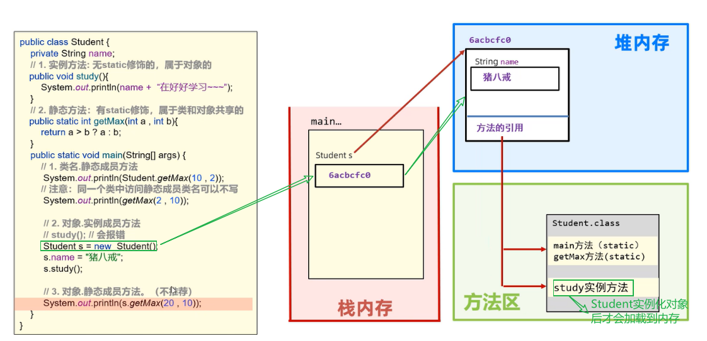
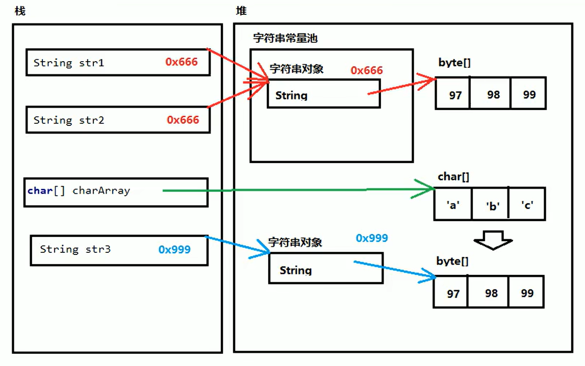

## Java基础速成笔记

### 文档注释
描述：使用jdk提供的javadoc工具可以解析成一套网页文件形式的说明文档

```shell
格式：javadoc -d 生成目标目录 -文档注释标签1 [-文档注释标签2] java文件
javadoc.exe -d D:\frank\ -author -version .\src\crashcourse\basic\Document_Comment.java
```

```java
package crashcourse.basic;


/**
 * @author guoshihao
 * @version 0.0.1
 */
public class Document_Comment {
    public static void main(String[] args) {
    }
}
```

结果如下：  
  


---


### static关键字

#### static是什么
- static是静态的意思，可以修饰成员变量和成员方法。
- static修改成员变量表示该成员变量在内存中**只存储一份**，可以被**共享访问，修改。**

#### 静态成员变量访问方式(User类)
成员变量分为：静态成员变量和实例成员变量

- 静态成员变量
    - 类名.静态成员变量名。(推荐)
    - 对象.静态成员变量名。(不推荐)
- 实例成员变量
  - 对象.实例成员变量

#### static修饰成员变量的内存原理


静态成员变量在加载类的时候就会被加载到堆内存中，实例成员变量只有在生成对象的时候才会被加载到堆内存中

#### 静态成员方法
成员方法的分类：
- 静态成员方法(有static修饰，归属于类)，建议用类名访问，也可以用对象访问。
- 实例成员方法(无static修饰，归属于对象)，只能用对象触发访问。

静态成员方法的访问方式：
- 类名.静态成员方法;(推荐)
- 对象名.静态成员方法;(不推荐)
- 静态成员方法;（:warning:只限于与静态成员方法同一个类的其他方法）

实例成员方法的访问方式：
- 对象名.实例成员方法;

#### static修改成员方法的内存原理
先加载类的静态方法；实例成员方法只有在生成实例是才会加载。
  

#### static注意事项
- 静态方法只能访问静态成员，不可以直接访问实例成员（实例成员只有在实例化后才会被加载到内存，而静态加载的更早）
- 实例方法可以访问静态成员，也可以访问实例成员。
- 静态方法是不可以实现this关键字的（因为this代表当前当前对象/实例）
```java
public class TestStatic {

    public static int onlineNumber = 10;
    private String name;

    //静态方法
    public static void test() {
        System.out.println("+++test+++");
        /*
            错误，run属于实例成员方法，静态方法test不可以访问
         */
        // run();

        /*
            错误，run属于实例成员变量，静态方法test不可以访问
        */
        // System.out.println(name);

        /*
            错误，静态方法不可以使用this关键字；
         */
        this.onlineNumber();
    }

    // 实例方法
    public void run() {
        System.out.println("Run fast");
        /* 实例成员方法可以访问实例成员也可以访问静态成员 */
        System.out.println(name);
        test();
        System.out.println(onlineNumber);
    }

    public static void main(String[] args) {
        TestStatic test = new TestStatic();
        test();
        test.run();
    }
}
```

#### static代码块
代码块的概述：
- 代码块是类的5大成分之一(构造器、成员变量、成员方法、代码块、内部类)
- 在Java类下，使用“{}”括起来的代码被称为代码块。

代码块分为：
- 静态代码块：
	- 格式：static {}
	- 特点：需要通过static关键字修饰，随着类的加载而加载，并且自动触发，只执行一次。
	- 使用场景：类加载的时候做一些静态数据的初始化的操作，以便后续使用。
- 构造代码块(了解，不常见)：
	- 格式：{}
	- 特点：每次创建对象，调用构造器执行时，都会执行该代码块中的代码，并且在构造器执行前执行。
	- 使用场景：初始化实例资源。

- Tips
	main方法、static代码块、构造代码块、构造方法的执行顺序：  
	**静态代码块 > main方法 > 构造代码块 > 构造方法。**

	其中静态代码块只执行一次。构造代码块在每次创建对象是都会执行。
```java
public class TestStatic {

    public static String name;

    TestStatic() {
        System.out.println("Loading TestStatic construct method......");
    }

    static {
        name = "XiBeiMinZu University";
        System.out.println("Loading static code block......");
    }

    {
        System.out.println("Loading construct code block......");
    }

    public static void main(String[] args) {
        System.out.println("Loading main method......");
        TestStatic test = new TestStatic();
    }
}

//:Output
/*
Loading static code block......
Loading main method......
Loading construct code block......
Loading TestStatic construct method......
*/
```

#### 创建工具类的注意事项
工具类提供公用的方法，最好不要实例化对象，一般通过对工具类构造函数进行私有化声明;
以包含生成n位验证码的工具类为例：
```java
public class Utils {

    // 私有化构造器，禁止生成Utils实例
    private Utils() {}
    /*
        生成验证码方法
     */
    public static String generateVerifyCode(int n) {
        String code = "";
        String data = "abcdefghijklmeopqrstuvwxyzABCDEFGHIJKLMEOPQRSTUVWXYZ0123456789";
        Random r = new Random();
        for(int i = 0; i < n; ++i) {
            int index = r.nextInt(data.length());
            code += data.charAt(index);
        }
        return code;
    }
}

```

---


### 继承
- 父类的私有成员子类有没有继承呢？  
	对于父类的私有成员，子类虽然不能访问也不能调用但是仍然属于继承了的(其实是可以通过暴力方法来强行访问或调用的)
- 父类的静态成员与子类共享；
- Java语言是单继承机制，不支持多继承；  
	举反例的话，若类C同时继承了类A和类B，而类A和类B都包含一个名为method的成员方法，这样类C在继承的时候就会面临冲突矛盾。
- 但是Java是多层继承的，如类A继承于类B，而类B继承于类C；
- 在子类方法中访问成员(成员变量、成员方法)满足：**就近原则** 
	- 先在子类局部范围寻找；
	- 如果没有找到，那就在子类成员范围寻找；
	- 如果没有找到，那就在父类成员范围寻找；
	- 如果还没找到，那就报错。  
	如果一定要是使用父类成员，那就使用super关键字调用。

---


### 字符串
#### 字符串常量池

字符串常量池：程序中直接写上的双引号字符串，就会放在字符串常量池中。  
new出的字符串不在常量池当中。  
对于基本类型来说，==是用来进行数值的比较  
对于引用类型来说，==是用来进行"地址值"的比较  
```java
public class Demo02StringPool {
    public static void main(String[] args) {
        // 字符串常量池对于相同字符串只存一个，所以str1和str2实际上是指向同一个地址值的
        String str1 = "abc";
        String str2 = "abc";
        char[] charArray = {'a', 'b', 'c'}
        String str3 = new String(charArray);

        System.out.println(str1 == str2); // true
        System.out.println(str1 == str3); // false
        System.out.println(str3 == str2); // false
    }
}
```
  

#### 字符串内容的比较
对于字符串的==是进行对象地址的比较，如果确实需要内容的比较，可以使用：

- public boolean equals(Object obj)
    :warning:注意事项：
    1. 任何对象都能使用Object进行接受
    2. equals方法具有对称性：a.equals(b)和b.equals(a)结果是一样的
    3. 如果比较双方一个常量一个变量一定要把常量放在前，否则可能出现空指针异常

- public boolean equalsIgnoreCase(String str)
    :warning:注意事项：
    1. 由于中文没有大小写，所以此方法对"abc二c".equalsIgnoreCase("abc贰c")的结果是false

```java
public class compareString {
    public static void main(String[] args) {
        String str1 = "Hello";
        String str2 = "Hello";
        char[] charArray = {'H', 'e', 'l', 'l', 'o'};
        String str3 = new String(charArray);

        System.out.println(str1 == str2); // true；地址值比较
        System.out.println(str1.equals(str2)); // true；内容比较
        System.out.println(str1 == str3); // false；地址值比较
        System.out.println(str1.equals(str3)); // true；内容比较
        System.out.println("Hello".equals(str3)); // true；内容比较

        System.out.println(".....................");
        String str4 = "abc";
        System.out.println("abc".equals(str4)); // 推荐
        System.out.println(str4.equals("abc")); // 不推荐，因为如果str4的引用值为null就报错空指针异常

        System.out.println(".....................");
        System.out.println("abc二c".equals("abc贰c")); // false
    }
}

```
### 集合容器
1. 集合容器使Java中的一组类库，主要作用使用来装载数据、对象元素的。
2. 容器分为单列容器和双列容器
	- 单列容器  
		Collection接口
			有序序列: List接口
				ArrayList类：底层是数组，方便查询操作；
				LinkList类：底层是双向链表，方便增删操作；
				Vector类：底层也是数组，考虑到了线程安全，但与ArrayList相比性能较差；
			无序序列：Set接口
				HashSet类
	- 双列容器
		Map接口
			HashMap类

