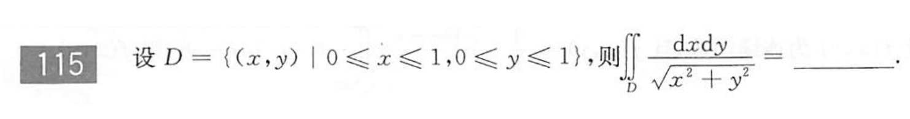
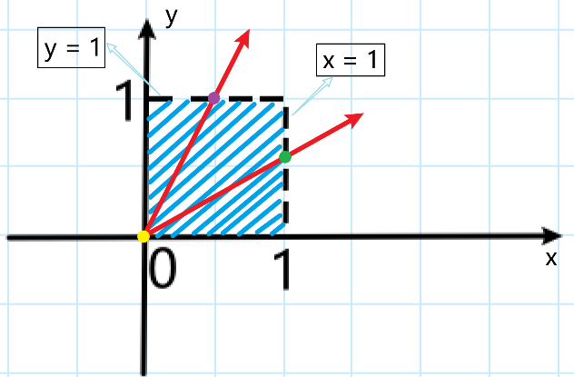
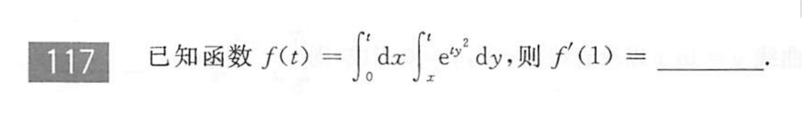
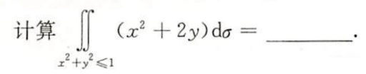
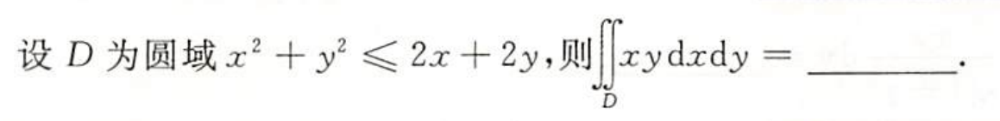
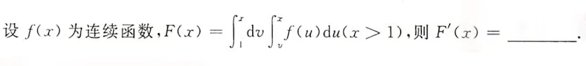
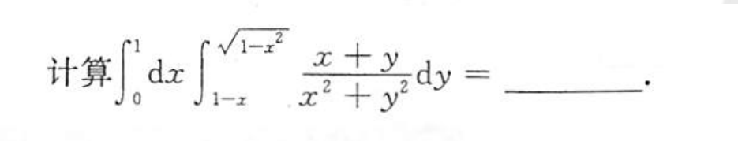
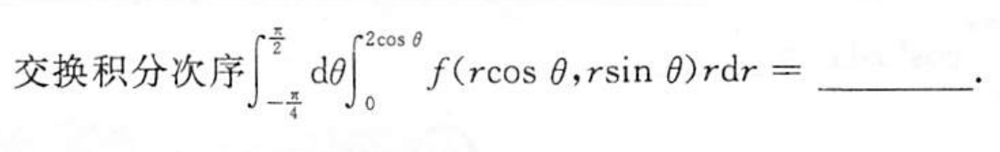

## 二重积分难题、错题集

- 660 第115题  
<rm>错因：转换成极坐标的二重积分时，对如何确定极径的积分上下限不够清楚</rm>  
  

<card>

:star: 极坐标确定极径上下限的一般方法(以660 第115题为例)  
如图所示，蓝色阴影部分为积分区域D，以原点为圆心作射线，并在D中逆时针旋转。  
  
不难看出，射线的起点(图中黄点)是极径长度的下限，在原点上，所以长度下限为0；  
射线与D的边界的交点(紫点、绿点)是极径长度的上限，$\theta$在0到$\frac{\pi}{4}$之间时，“上限点”(绿点)为$x = 1$；
$\theta$在$\frac{\pi}{4}$到$\frac{\pi}{2}$之间时，“上限点”(紫点)为$y = 1$
所以极径的上限长度要拆分为两种情况：  
第一种是$\theta$在0到$\frac{\pi}{4}$之间，极径长度上限为：<bm>$x = 1 \Longrightarrow r\cos{\theta} = 1 \Longrightarrow r = \frac{1}{\cos{\theta}}$；</bm>  
第二种是$\theta$在$\frac{\pi}{4}$到$\frac{\pi}{2}$之间，极径长度上限为：<bm>$y = 1 \Longrightarrow r\sin{\theta} = 1 \Longrightarrow r = \frac{1}{\sin{\theta}}$。</bm>

所以，二重积分的极坐标形式为：$\int_{0}^{\frac{\pi}{4}}d\theta\int_{0}^{\frac{1}{\cos{\theta}}}dr + \int_{\frac{\pi}{4}}^{\frac{\pi}{2}}d\theta\int_{0}^{\frac{1}{\sin{\theta}}}dr$

</card>

- 660 第117题  
<rm>错因：对分式求导公式运用不熟练</rm>  
<bm>变限二重积分的求导</bm>  
  

- 660 第113题  
<bm>对称性和奇偶性；轮换对称性</bm>  
  

- 600 第114题  
<bm>对称性和奇偶性；积分区域偏离对称轴的换元处理</bm>  
  

- 21年660 第117题  
<bm>变限二重积分的求导</bm>  
  

- 660 第110题  
<bm>直角坐标二重积分转极坐标二重积分求导</bm>  
  

- 660 第116题  
<bm>带绝对值的二重积分</bm>  
  

- 660 第109题  
<bm>极坐标二重积分交换积分次序</bm>  
<rm>注意练习辅导讲义192页例2所用的方法一</rm>  
  

