## 矩阵运算

### 大纲
1. 概念、运算
	+ <bm>乘法</bm>, <bul>$\alpha\beta^T \space \alpha^T\beta \space \alpha\alpha^T \space \alpha^T\alpha$</bul>
2. 伴随矩阵、可逆矩阵
	+ <rm>$AA^*=A^*A=|A|E$
3. 初等变换、初等矩阵
4. 分块矩阵
5. 方阵的行列式
	+ <bm>秩</bm>

---

### 矩阵的基本运算和特殊矩阵
#### 矩阵的基本运算
- <rm>若$A$可逆，则$E = AA^{-1}$</rm>
- $(A - B)(B - A) = A^{2} - B^{2} \Longleftrightarrow AB = BA$
- $A(B - C) = AB - AC；\quad (B - C)A = BA - CA$
- 略

#### 特殊矩阵
- **同型矩阵**：A和B都是m行n列的矩阵，就称它们为同型矩阵。

- **初等矩阵**：单位矩阵经过<bm>一次</bm>初等变换得到的矩阵，<rm>初等矩阵均可逆</rm>。

- **对称阵**：满足$A^{T} = A$的矩阵。

- **实对称矩阵**：矩阵元素都是实数的对称矩阵。

- **反对称阵**：满足$A^{T} = -A$的矩阵。

- **正交矩阵**：$A^{T}A = AA^{T} = E，即$ <bm>$A^{T} = A^{-1}$</bm>

- **对角矩阵**：非对角元素都是0的矩阵。
	+ 进一步细分为主对角矩阵和次对角矩阵；
	+ 主对角矩阵的逆：
$
\begin{bmatrix}
a_{11} & 0 & 0 & 0 \\
0 & a_{22} & 0 & 0 \\
0 & 0 & \cdots & 0 \\
0 & 0 & 0 & a_{nn}
\end{bmatrix}^{-1}
=
\begin{bmatrix}
a_{11}^{-1} & 0 & 0 & 0 \\
0 & a_{22}^{-1} & 0 & 0 \\
0 & 0 & \cdots & 0 \\
0 & 0 & 0 & a_{nn}^{-1}
\end{bmatrix}
$    
	+ 次对角矩阵的逆<rm>:warning:(注意对角线元素的对调)：</rm>  
$
\begin{bmatrix}
0 & 0 & 0 & a_{1n} \\
0 & 0 & \cdots & 0 \\
0 & \cdots & 0 & 0 \\
a_{n1} & 0 & 0 & 0 \\
\end{bmatrix}^{-1}
=
\begin{bmatrix}
0 & 0 & 0 & a_{n1}^{-1} \\
0 & 0 & \cdots & 0 \\
0 & \cdots & 0 & 0 \\
a_{1n}^{-1} & 0 & 0 & 0 \\
\end{bmatrix}^{-1}
$

#### 习题
1. 1800 52页 矩阵第3题(矩阵的基本运算、初等变换左乘右乘)  
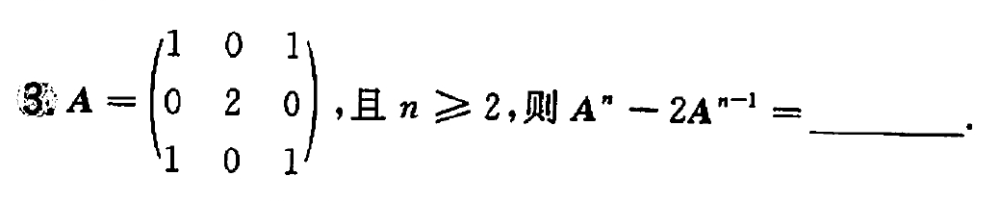  

---

### 初等矩阵和初等变换
初等变换类型(以初等行变换为例)：

- **倍乘**：
	+ 定义：用非0常数k乘A某行(列)的每个元素。
	+ 对应的逆矩阵：倍乘得到的初等矩阵的逆矩阵等于<bm>将倍数改为倍数的倒数</bm>；比如：
	$
	\begin{bmatrix}
	1 & 0 & 0 \\
	0 & k & 0 \\
	0 & 0 & 1 \\
	\end{bmatrix}^{-1}
	$ = 
	$
	\begin{bmatrix}
	1 & 0 & 0 \\
	0 & \frac{1}{k} & 0 \\
	0 & 0 & 1 \\
	\end{bmatrix}
	$

- **互换**：
	+ 定义：互换A中两行元素的位置。
	+ 对应的逆矩阵：互换得到初等矩阵的逆矩阵等于<bm>其本身</bm>，比如：
	$
	\begin{bmatrix}
	0 & 1 & 0 \\
	1 & 0 & 0 \\
	0 & 0 & 1 \\
	\end{bmatrix}^{-1}
	$ = 
	$
	\begin{bmatrix}
	0 & 1 & 0 \\
	1 & 0 & 0 \\
	0 & 0 & 1 \\
	\end{bmatrix}
	$

- **倍加**：
	+ 把A中某行(列)所有元素的k倍加到另一行(列)对应的元上。
	+ 对应的逆矩阵：倍加矩阵的逆矩阵等于<bm>将倍数改为相反数</bm>，比如：
	$
	\begin{bmatrix}
	1 & 0 & 0 \\
	k & 1 & 0 \\
	0 & 0 & 1 \\
	\end{bmatrix}^{-1}
	$ = 
	$
	\begin{bmatrix}
	1 & 0 & 0 \\
	-k & 1 & 0 \\
	0 & 0 & 1 \\
	\end{bmatrix}
	$

**行变换**：初等矩阵P<rm>左乘</rm>矩阵A，其乘积PA就是矩阵A做一次与P同样的<rm>行变换</rm>得到的矩阵。

**列变换**：初等矩阵Q<rm>右乘</rm>矩阵A，其乘积AQ就是矩阵A做一次与Q同样的<rm>列变换</rm>得到的矩阵。

<plain>

- 可逆矩阵一定可以由单位矩阵经过若干次初等变换得到。
- :star:<rm>初等变换不改变矩阵的秩。</rm>

</plain>

#### 习题
1. 660 359题(可逆矩阵左乘、右乘；初等变换求矩阵的逆)
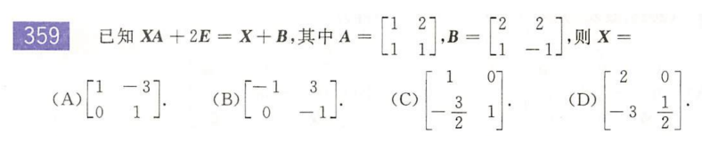  

2. 660 364题(可逆矩阵左乘、右乘)  
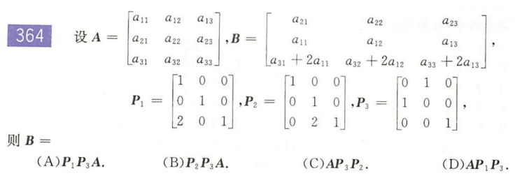  

---

### 转置矩阵、伴随矩阵和逆矩阵
#### 常用公式

"组合":  
- $(A^{T})^{-1} = (A^{-1})^{T}$
- $(A^{*})^{-1} = (A^{-1})^{*} = \frac{1}{|A|}A$
- $(A^{*})^{T} = (A^{T})^{*}$

"自组合"：
- $(A^{T})^{T} = A$
- <rm>$(A^{*})^{*} = |A|^{n-2}A \ (n \ge 2)$</rm>
- $(A^{-1})^{-1} = A$

"数乘"：
- $(kA)^{T} = kA^{T}$
- $(kA)^{*} = k^{n-1}A^{*}$
- $(kA)^{-1} = \frac{1}{k}A^{-1}$

"相加"：
- $(A + B)^{T} = A^{T} + B^{T}$
- $(A + B)^{*} 不确定$
- $(A + B)^{-1} 不确定$

"相乘"
- $(AB)^{T} = B^{T}A^{T}$
- $(AB)^{*} = B^{*}A^{*}$
- $(AB)^{-1} = B^{-1}A^{-1}$

"行列式"
- $|A^{T}| = |A|$
- $|A^{*}| = |A|^{n-1}$
- $|A^{-1}| = \frac{1}{|A|}$

#### 求矩阵A的伴随的常用方法

<plain>

方法一：定义法，即求出所有的代数余子式 (适用于2阶、3阶矩阵)

方法二：先求逆矩阵，再根据伴随和逆矩阵的关系求得伴随。

</plain>

#### 求矩阵A的逆的常用方法
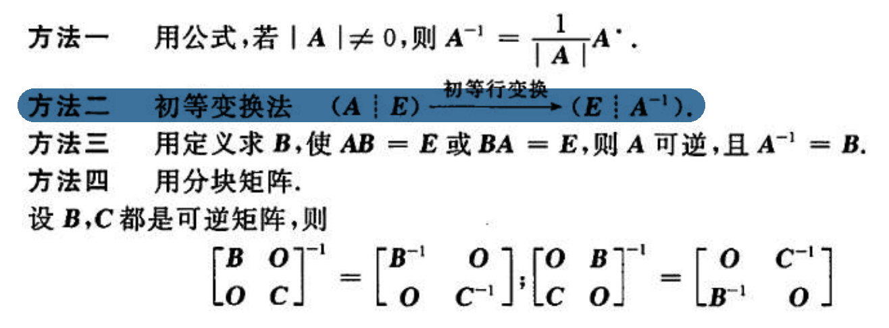  

#### 习题
1. 660 356题(次对角矩阵的逆，伴随矩阵与逆矩阵的关系)
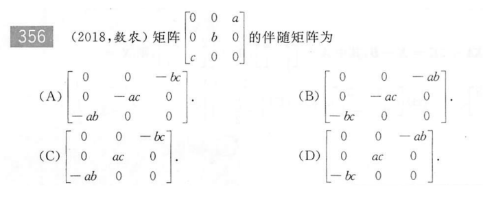  

---

### :fire:矩阵的秩
+ **"木桶效应"(个人杜撰的名字)**
	- 若A是$m \times n$矩阵，则<bm>$r(A) \le \min{(m, n)}$</bm>
	- <bm>$r(AB) \le \min{(r(A), r(B))}$</bm>
	- 若n阶矩阵A可逆，则<rm>$r(AB) = r(B)，r(BA) = r(B)$</rm>
+ **转置矩阵**：$r(A) = r(A^{T})$; $r(A^TA) = r(A)$
+ **伴随矩阵**：

	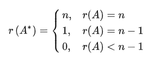  
+ **逆矩阵**：若n阶矩阵A可逆，则$r(A^{-1}) = r(A) = n$
+ **分块矩阵**：
$
r
\begin{pmatrix}
A & O \\
O & B \\
\end{pmatrix}
= r(A) + r(B)
$
+ **三大关系**：
	- 等价：$r(A) = r(B)$
	- 相似：$r(A) = r(B)$
	- 合同：$r(A) = r(B)$
+ **其他**：
	- 当$k \ne 0$时，$r(kA) = r(A)$
	- $r(A+B) \le r(A) + r(B)$
	- 若矩阵$A$是$m \times n$，$B$是$n \times s$，且$AB = O$，<bm>$r(A) + r(B) \le n$</bm>

#### 习题
1. 660 617题(“木桶效应”求秩、初等变换求秩)  
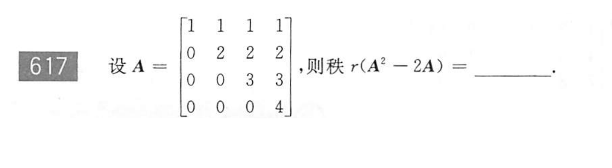  

2. 660 368题(矩阵秩的概念)  
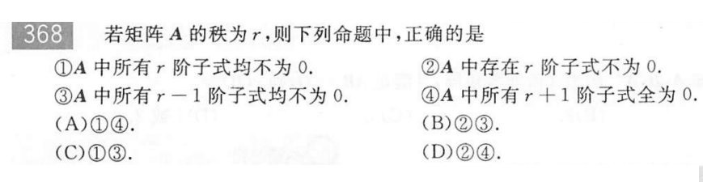  

3. 660 370题(“木桶效应”求秩)  
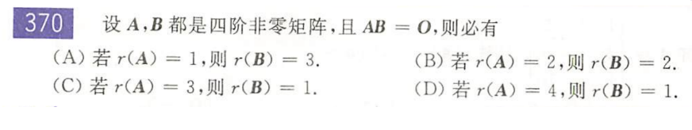  

4. 660 372题(根据行列式求矩阵的秩)  
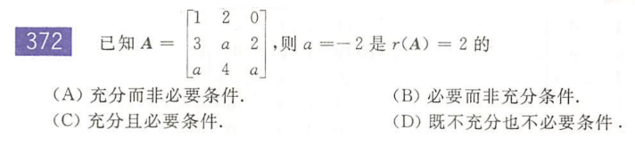  

5. 660 373题(伴随矩阵的秩；初等变换求秩)  
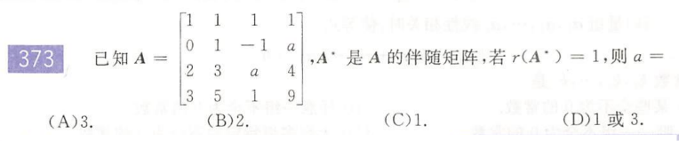  

6. 660 649题(伴随矩阵的秩)  
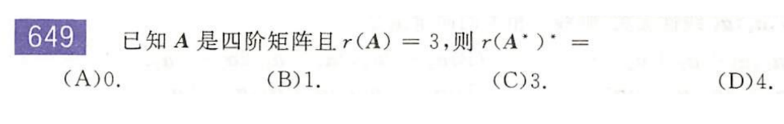  

---

### 矩阵等价

**定义** 矩阵A经过有限次<bm>初等变换</bm>得到矩阵B，则称矩阵A和矩阵B等价。记为<rm>$A \cong B$</rm>

**充要条件1** A和B是同型矩阵，$A \cong B \Longleftrightarrow r(A) = r(B)$

**充要条件2** A和B是同型矩阵，矩阵P、Q可逆，$A \cong B \Longleftrightarrow PAQ = B$

#### 习题
1. 660 330题(矩阵等价的充要条件)  
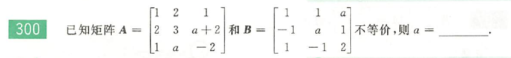  

---

